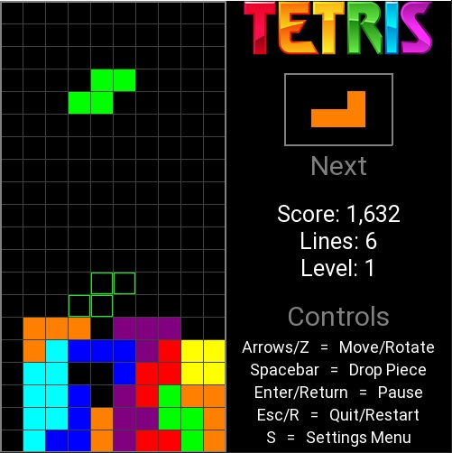

# READ ME (Or don't...see what I care.)

This is a Python-based (using the Pygame module) version of Tetris (unofficial, of course). Code by hexadeci-male and Tetris by Alexey Pajitnov. Other things made by other groups and people that I couldn't trace back to their origins.

# REQUIREMENTS:

Python script and source need Python 3.6+ and Pygame 1.9.6+ to play and execute.

# INSTALL & PLAY:

Simply run the 'Pytris' executable/app (or "pytris" script if applicable) and make sure the 'assets' folder is in the same directory as the program itself, otherwise the game won't run!

The game automatically creates/saves your game settings and highscores to some text files inside the asset folder. These files can be safely deleted.

Don't mess with the asset folder, unless you know what you are doing. The game won't load without the asset folder and it's proper contents.

You can replace the sounds/graphics files with your own if you want...just make sure it's the same name and file type.

# SETTINGS:

**Window:** Change the window resolution to be bigger or smaller (500x500,600x600,800x800)

**Sound:** Turn sound on or off (really just changing the volume)

**Music:** Turn music on or off (really just changing the volume)

**Difficulty:** All it actually does is change the grid size (20x40,10x20,5x10) - crazy mode is fun!

**Style:** Ever wanted to see Tetris blocks as balls? Now you can!

**Colors:** Change the palette of the blocks (Standard, Odd, Black & White, NES Tetris - 2 color sets plus white that changes every level!)

**Mirrored:** Swap the game board and control area so they are on opposite sides of the screen

**Guides:** Show or hide the helpful ghost pieces

**Sandwich:** LOL

# SOURCE CODE:

You can find the source code and other stuff for this game on my GitHub (https://github.com/hexadeci-male)

Play around with it or whatever if you're good at coding/python

If someone wants to make a pyinstaller/py2app mac executable of this game (icons are included), that would be awesome and I would be grateful. I tried it myself but I failed spectacularly for various reasons. :(

# LICENSE:

This software is licensed under MIT.

This was more a coding exercise rather than a full-fledged game dev project. No copyright infringement intended - just needed some assets from the interwebz. Apart from my code, I have no real idea who made what.
